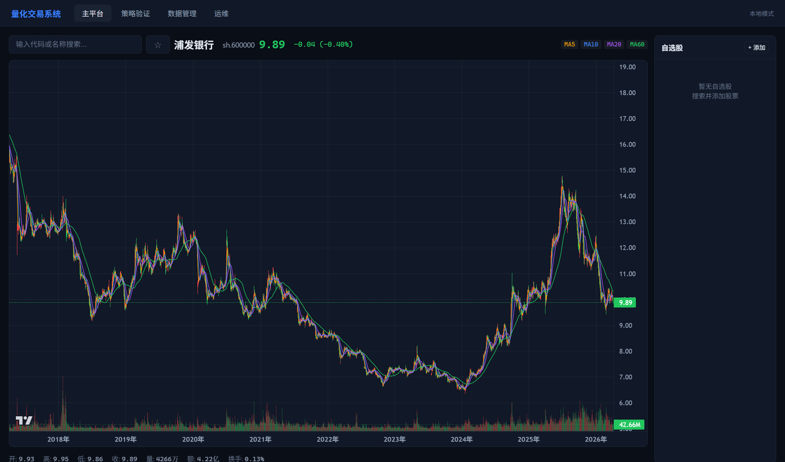
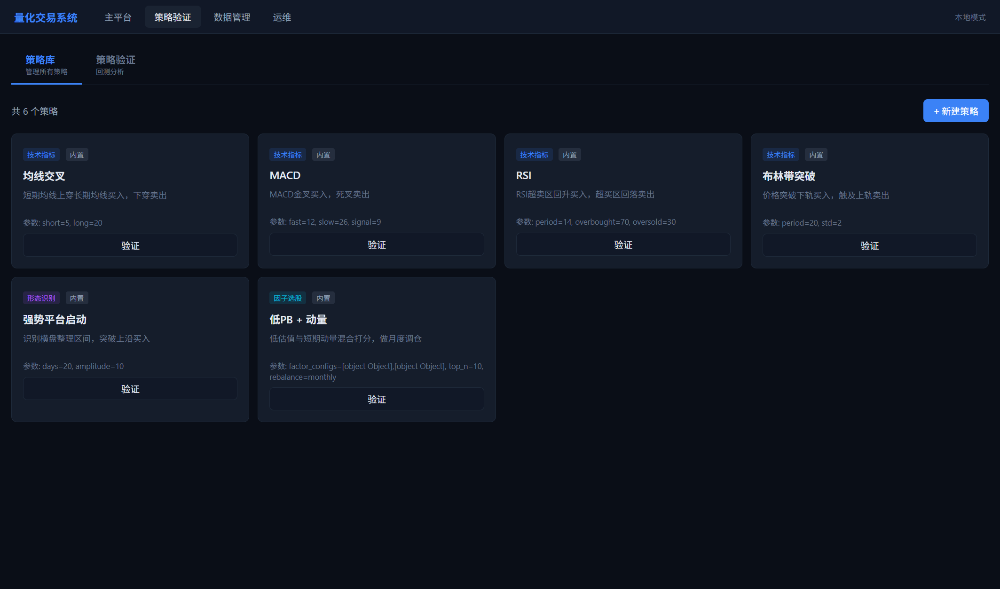

# Fuxi Quant

本地优先的量化因子研究与回测系统。

当前项目重点不是“服务器常驻量化平台”，而是**在 Windows 本机直接运行**，把重的回测和数据清洗都放在本地做；后续 Nova 需要时，优先通过 **异步 HTTP API** 调用本机 Fuxi，再通过 **MCP 包装层**把这些 API 暴露成 Nova 可直接使用的工具。

## 当前状态

已支持：

- 单股票技术策略回测
- 截面因子选股回测
- Python 脚本因子策略
  - 上传 `.py` 文件
  - 页面内直接新增 / 编辑脚本
  - 支持 `score_stocks()` 和 `select_portfolio()` 两种脚本协议
- 本地无登录模式
- Nova 可直接调用的异步 Job API
- Job 取消 / artifact 落盘 / 日志查询
- Fuxi MCP 包装层（基于本地 API）

## 界面截图

### 主平台



### 策略验证



## 技术栈

### 后端

- **FastAPI**：API 服务与静态资源托管
- **SQLite + Parquet + DuckDB**：业务数据继续使用 SQLite；行情元数据保留在 SQLite，重型历史查询逐步切到 DuckDB + Parquet
- **APScheduler**：定时任务（当前项目里已有调度基础）
- **统一异步 Job System**：长任务走 submit/status/result/logs 流程，支持 webhook + 轮询双保险
- **Job artifacts**：大结果按 job 落盘到 artifact 目录，避免把完整曲线/明细全塞进状态接口
- **Python 因子脚本执行**：支持 inline script / saved strategy script
- **MCP Server 包装层**：将 Fuxi API 转成 Nova 可直接调用的 MCP tools

### 前端

- **原生 ES Module**
- **Lightweight Charts**：收益曲线与行情图表
- 当前 UI 已支持：
  - 策略库
  - 因子模板配置
  - 脚本上传与在线编辑
  - 因子回测结果面板

### 数据

当前历史股票数据通过 **baostock** 获取，下载入口在：

- `backend/app/data/baostock_provider.py`
- `backend/app/data/downloader.py`

### 市场存储布局（Phase 1）

当前已开始做“业务数据 / 行情数据”解耦：

- `data/db/business.db`：业务数据（策略配置、任务状态、回测记录等）
- `data/market/market.db`：行情元数据与 SQLite 基础表
- `data/market/parquet/stock_daily/`
- `data/market/parquet/stock_weekly/`
- `data/market/parquet/stock_monthly/`

约定上，`backend/app/data/storage.py` 仍然是唯一支持的数据访问入口；DuckDB + Parquet 只是其内部实现细节，API / Job / MCP / 因子模块都不应该绕过它直接读取行情文件。

当前可直接用于因子逻辑的字段主要来自 `stock_daily`：

- `close`
- `amount`
- `turn`
- `peTTM`
- `pbMRQ`
- `psTTM`
- `pcfNcfTTM`

### 服务器现有数据库

已确认服务器上有一份历史数据库，可作为本地初始化底库：

- 路径：`/root/lianghua/data/market/market.db`
- 大小：约 `2.2G`
- 股票数：`7182`
- `stock_daily`：约 `1214 万` 条
- 日期范围：`2015-01-05` ~ `2026-04-10`

当前项目新增了异步导入任务接口，可在把数据库拉回本地后导入到当前运行实例。

## 目录结构

```text
lianghua/
├── backend/
│   └── app/
│       ├── api/
│       │   ├── backtest.py        # 技术策略 + 同步因子回测 API
│       │   ├── jobs.py            # 异步任务 API（Nova 优先调用）
│       │   ├── strategy.py        # 策略库 / 自定义脚本策略
│       │   └── market.py          # 行情与股票列表
│       ├── core/
│       │   ├── engine.py          # 单股票技术策略回测引擎
│       │   ├── jobs.py            # Job 持久化 / 执行 / webhook 回调
│       │   ├── job_handlers.py    # 因子回测 / 数据任务处理器
│       │   ├── factor_backtest.py # 截面因子组合回测引擎
│       │   └── factor_runner.py   # 因子任务入口（Nova 调用的核心路径）
│       ├── factors/
│       │   ├── base.py            # 因子打分基础能力
│       │   └── builtin.py         # 内置因子定义
│       ├── data/
│       │   ├── baostock_provider.py # baostock 数据源
│       │   ├── downloader.py        # 数据下载 / 更新 / 清洗入口
│       │   └── storage.py           # 多股票历史读取、交易日读取
│       └── mcp_server.py          # Fuxi MCP server（对 Nova 暴露工具）
├── frontend/
│   ├── index.html
│   └── modules/
│       ├── app.js
│       ├── api/client.js
│       └── pages/backtest.js
├── docs/
│   ├── factor-module-api.md       # 面向 Nova 的因子 API 说明
│   └── images/
│       ├── platform-page.png      # README 主平台截图
│       └── backtest-page.png      # README 策略验证截图
├── scripts/
│   └── deploy_mac.py              # macOS 部署脚本（建库 + 拉 baostock + 启动）
├── CHANGELOG.md
└── README.md
```

## 本地运行

### 1. 安装依赖

```bash
cd backend
pip install -r requirements.txt
```

### 2. 启动服务

```bash
python -m uvicorn app.main:app --host 127.0.0.1 --port 8000 --app-dir backend
```

启动后直接访问：

- `http://127.0.0.1:8000/#/platform`
- `http://127.0.0.1:8000/#/backtest`

当前默认是**无登录模式**。

## macOS 部署

当前仓库新增了一个面向 macOS 的部署脚本：

- `scripts/deploy_mac.py`

它会按顺序完成：

1. 创建 `.venv`
2. 安装 `backend/requirements.txt`
3. 初始化 SQLite 数据库
4. 直接通过 baostock 做全量下载（默认 `--download-mode full`）
5. 启动本地 FastAPI 服务

最常用的两种方式：

```bash
python3 scripts/deploy_mac.py --dry-run
python3 scripts/deploy_mac.py
```

如果你只想看将要执行什么命令，用 `--dry-run`；如果要调整下载模式，也可以显式传：

```bash
python3 scripts/deploy_mac.py --download-mode test
python3 scripts/deploy_mac.py --download-mode update
```

后续只要项目的依赖、建库流程、下载链路或启动命令发生变化，都应该同步更新这个脚本，避免 README 和实际部署流程脱节。

## 因子模块能力

### 1. 模板因子策略

通过 `factor_configs` 定义因子组合，例如：

- `pb`
- `pe`
- `ps`
- `momentum_20`
- `momentum_60`
- `momentum_120`

平台负责：

- 股票池读取
- 截面排序
- TopN 选股
- 调仓
- 交易成本计算
- 权益曲线与调仓结果输出

### 2. Python 脚本因子策略

支持三种脚本协议：

#### A. 旧版分数脚本（兼容保留）

```python
def score_stocks(histories, context):
    return {code: rows[-1]["close"] for code, rows in histories.items()}
```

#### B. 新版表格分数脚本（推荐）

```python
def score_frame(frame, context):
    latest = frame.sort_values(["code", "date"]).groupby("code").tail(1)
    return dict(zip(latest["code"], latest["close"]))
```

#### C. 旧版组合脚本（兼容保留）

```python
def select_portfolio(histories, context):
    return [
        {"code": "sz.000001", "weight": 1.0}
    ]
```

### 脚本执行稳定性

脚本型因子任务现在有 4 种终态：

- `success`
- `script_error`
- `timeout`
- `cancelled`

其中 `score_frame()` / `score_stocks()` / `select_portfolio()` 三种脚本协议都会经过统一的受控执行路径；超时和取消状态会通过同步 API、异步 Job API 和 MCP 查询接口返回结构化结果。

可选参数：

- `script_timeout_seconds`：脚本执行超时秒数，必须是正数；默认 `10` 秒，可在同步 API、异步 Job API 和 MCP 提交时覆盖。

## 核心 API

### 获取策略列表

```http
GET /api/strategy/list
```

### 新建脚本策略

```http
POST /api/strategy/create
Content-Type: application/json
```

```json
{
  "name": "脚本因子测试",
  "type": "factor",
  "description": "按脚本分数选股",
  "params": {
    "top_n": 5,
    "rebalance": "monthly"
  },
  "code": "def score_stocks(histories, context):\n    return {code: rows[-1]['close'] for code, rows in histories.items()}"
}
```

### 同步运行因子回测

```http
POST /api/backtest/factor/run
Content-Type: application/json
```

这是保留给本地调试 / 前端直接调用的同步入口。

支持三种调用方式：

#### 方式 A：模板因子配置

```json
{
  "factor_configs": [
    {"key": "pb", "weight": 0.5},
    {"key": "momentum_20", "weight": 0.5}
  ],
  "top_n": 10,
  "start_date": "2023-01-01",
  "end_date": "2024-12-31",
  "capital": 100000,
  "rebalance": "monthly",
  "pool_codes": ["sh.600000", "sz.000001"]
}
```

#### 方式 B：直接传 inline 脚本

```json
{
  "script": "def select_portfolio(histories, context):\n    return [{\"code\": \"sz.000001\", \"weight\": 1.0}]",
  "top_n": 1,
  "start_date": "2023-01-01",
  "end_date": "2024-12-31",
  "capital": 100000,
  "rebalance": "monthly",
  "pool_codes": ["sh.600000", "sz.000001"]
}
```

#### 方式 C：调用已保存脚本策略

```json
{
  "strategy_id": "custom_xxxxxxxx",
  "start_date": "2023-01-01",
  "end_date": "2024-12-31",
  "capital": 100000,
  "pool_codes": ["sh.600000", "sz.000001"]
}
```

### 查询同步因子回测结果

```http
GET /api/backtest/factor/{run_id}
```

### 异步 Job API（推荐给 Nova）

#### 提交因子回测任务

```http
POST /api/jobs/backtest/factor
Content-Type: application/json
```

额外支持：

- `callback_url`
- `callback_secret`

#### 查询任务状态

```http
GET /api/jobs/{job_id}
```

#### 获取完整结果

```http
GET /api/jobs/{job_id}/result
```

#### 获取任务日志

```http
GET /api/jobs/{job_id}/logs
```

#### 获取 artifact 清单

```http
GET /api/jobs/{job_id}/artifacts
```

#### 获取单个 artifact 内容

```http
GET /api/jobs/{job_id}/artifacts/{artifact_name}
```

#### 取消任务

```http
POST /api/jobs/{job_id}/cancel
```

#### 提交数据更新任务

```http
POST /api/jobs/data/update
```

#### 导入本地数据库文件

```http
POST /api/jobs/data/import-db
```

## Nova 集成建议

当前推荐的接法：

1. 在 Windows 本机启动量化服务
2. Nova 优先调用异步 Job API：
   - `POST /api/jobs/backtest/factor`
   - `GET /api/jobs/{job_id}`
   - `GET /api/jobs/{job_id}/result`
   - `GET /api/jobs/{job_id}/artifacts`
   - `POST /api/jobs/{job_id}/cancel`
3. 如果配置了 `callback_url`，Fuxi 任务完成后会 webhook 回调 Nova
4. 如果要更自然地接入 agent 工具链，再通过 MCP 运行：
   - `python -m app.mcp_server`

### Nova MCP 配置示例

可在 Nova 的 `mcp_servers` 中增加一项：

```json
{
  "tools": {
    "mcp_servers": {
      "fuxi": {
        "command": "python",
        "args": ["-m", "app.mcp_server"],
        "env": {
          "PYTHONPATH": "D:/AAA/lianghua/backend"
        }
      }
    }
  }
}
```

### MCP 返回契约

当前 Fuxi MCP tools 已统一返回结构化对象，Nova 侧优先读取 `structuredContent`：

```json
{
  "ok": true,
  "data": {
    "job": {
      "id": "job_xxxxxxxxxxxx",
      "status": "queued"
    }
  },
  "error": null
}
```

失败时：

```json
{
  "ok": false,
  "data": null,
  "error": {
    "code": "job_not_found",
    "message": "任务不存在"
  }
}
```

字段约定：

- `submit_factor_backtest` / `submit_data_update` / `submit_data_import` → `data.job`
- `get_job_status` / `cancel_job` → `data.job`
- `get_job_result` → `data.result`
- `get_job_artifacts` → `data.artifacts`
- `get_job_logs` → `data.logs`

兼容说明：即使客户端退回到 `TextContent`，文本 JSON 也与上述结构一致，不需要再解析旧版裸结果。

更详细的请求/响应结构，请看：

- [`docs/factor-module-api.md`](./docs/factor-module-api.md)

## 当前验证情况

当前已经验证：

- 后端测试通过
- 因子模板回测可用
- Python 脚本策略可用
- 前端支持上传 `.py` 文件并保存策略
- 前端支持在线编辑脚本并直接运行
- 本地无登录模式可直接进入 `#/backtest`
- 本地 API 已可被外部调用
- 异步 Job API 已可提交 / 查询 / 获取结果 / 获取日志 / 获取 artifacts / 取消任务
- 本地 Nova 已可通过 `APITestTool` 调用本机 Fuxi API
- 本地 Nova / MCP client 已可通过 Fuxi MCP tools 获取日志与 artifact 清单

## 仓库

- GitHub: `https://github.com/yufan001/fuxi-quant`
